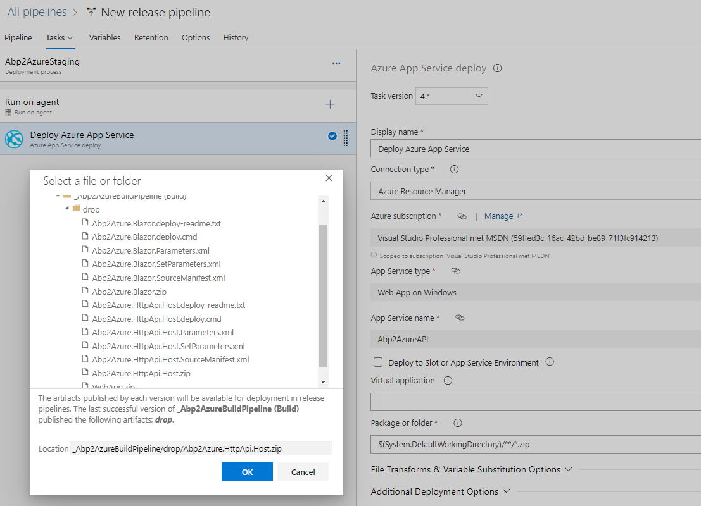
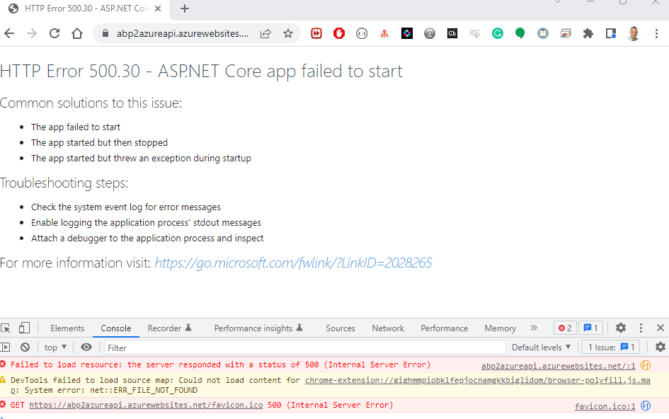

## ABP Framework to Azure

### Continuous Deployment of an ABP Framework app to Azure DevOps

A step-by-step tutorial on how to set up Continuous Deployment in Azure DevOps of an ABP Framework application.

### Source Code

The sample application has been developed with **Blazor** as UI framework and **SQL Server** as database provider, but the same principles apply for other UI frameworks/database providers.

The source code of the completed application is [available on GitHub](https://github.com/bartvanhoey/Abp2Azure).

### Requirements

The following tools are needed to be able to run the solution.

* .NET 6.0 SDK
* VsCode, Visual Studio 2022 or another compatible IDE
* ABP CLI version 6.0.0

### Step-by-step Tutorial

[1. Create a new GitHub repository](#create-a-new-github-repository)

[2. Create a new ABP Framework application](#create-a-new-abp-framework-application)

[3. Create an SQL Database in Azure](#create-an-sql-database-in-azure)

[4. Set up the Build pipeline in AzureDevops](#set-up-the-build-pipeline-in-azuredevops)

[5. Create a Web App in the Azure Portal](#create-a-web-app-in-the-azure-portal)

[6. Create Release pipeline and deploy HttpApi.Host project](#create-release-pipeline-and-deploy-httpapihost-project)

[7. Deployment succeeded, but Web App not working. Fix the issues](#deployment-succeeded-but-web-app-not-working-fix-the-issues)

[Part 8: Create a Web App in the Azure Portal to deploy [YourAppName].Blazor project](https://abpioazuredevopsblazor.azurewebsites.net/part8)

[Part 9: Add an extra Stage in the Release pipeline in the AzureDevops to deploy [YourAppName].Blazor project](https://abpioazuredevopsblazor.azurewebsites.net/part9)

[Part 10: Release pipeline finished, Deployment [YourAppName].Blazor project succeeded, but Web App still not working. How to fix the issues?](https://abpioazuredevopsblazor.azurewebsites.net/part10)


### Create an SQL Database in Azure

* Login into [Azure Portal](https://portal.azure.com/)

* Click **Create a resource**

* Search for *SQL Database*

* Click the **Create** button in the *SQL Database window*

* Create a new resource group. Name it *rg[YourAppName]*

* Enter *[YourAppName]Db* as database name

* Create a new Server and name it *[YourAppName]server*

* Authentication method: Use Sql authentication

* Enter a [serveradmin] login and passwords. Click the **OK** button

* Click **Configure database**. Go to the *Basic* version and click the **Apply** button

* Click the **Review + create** button. Click **Create**

* Go to Azure Resources and navigate to the **SQL server** when the SQL Database is created

* Click **Networking** under Security left side menu.

* In the Public Access tab, select **Selected networks** and click **Add your client IPv4 address** at the Firewall rules. Save.

* In the **Exceptions** section, select **Allow Azure and resources to access this server** and save

* Go to your **SQL database**, click **Connection strings** and copy the connection string

* Replace the Default connection string in the appsettings.json files of the [YourAppName].HttpApi.Host and the [YourAppName].DbMigrator project

* Do not forget to replace {your_password} with the correct server password you entered in Azure SQL Database

* Open a terminal in the [YourAppName].DbMigrator project and run the command below to apply the db migrations

```bash
    dotnet run
```

* Open a command prompt in the [YourAppName].HttpApi.Host project and start your API.

```bash
    dotnet run
```

Stop the [YourAppName].HttpApi.Host by entering **CTRL+C**

* Open a terminal in the root folder of your project. Add, commit and push all your changes to your GitHub repo

```bash
    git add .
    git commit -m database_created
    git push
```

### Set up the Build pipeline in AzureDevops

* Open the [AzureDevops](https://azure.microsoft.com/en-us/services/devops/) page and click on the **Sign in to Azure Devops link**
* Click on **New organization** and follow the steps to create a new organization. Name it [YourAppName]org
* Enter [YourAppName]Proj as project name in the **Create a project to get started** window
* Select **Public visibility** and click the **Create project** button
* Click on the **Pipelines** button to continue
* Click on the **Create Pipeline** button
* Select **GitHub** in the **Where is your code window?**


* Select your GitHub [YourAppName]repo.
* Click on **Approve and install** in the **Repository access** section in the Azure Pipelines window
  
  

* You get redirected to the **Configure your pipeline** window. Select **ASP.NET Core (.NET Framework)**
* You get redirected to the **Review your pipeline YAML** window. Click **Save and run**


* Click **Save and run** in (commit directly to the main branch checked) the **Save and run** window
* The pipeline should start running.

**ATTENTION:**

Probably the BUILD will fails with this error message. You can read more about [No hosted parallelism has been purchased or granted](https://stackoverflow.com/questions/68405027/how-to-resolve-no-hosted-parallelism-has-been-purchased-or-granted-in-free-tie) on StackOverflow

```bash
    1 error(s), 0 warning(s)
    No hosted parallelism has been purchased or granted. To request a free parallelism grant, please fill out the following form https://aka.ms/azpipelines-parallelism-request
```

* Comment out the VSTest@2 task as this tasks throws an error
* Add the 3 tasks (Run unit tests, Dotnet publish, Publish artifact) below in **azure-pipelines.yml** file.

```bash
trigger:
- main

pool:
  vmImage: 'windows-latest'

variables:
  solution: '**/*.sln'
  buildPlatform: 'Any CPU'
  buildConfiguration: 'Release'

steps:
- task: NuGetToolInstaller@1
  displayName: Install Nuget tool

- task: NuGetCommand@2
  displayName: Restore Nuget packages
  inputs:
    restoreSolution: '$(solution)'

- task: VSBuild@1
  displayName: Build project
  inputs:
    solution: '$(solution)'
    msbuildArgs: '/p:DeployOnBuild=true /p:WebPublishMethod=Package /p:PackageAsSingleFile=true /p:SkipInvalidConfigurations=true /p:DesktopBuildPackageLocation="$(build.artifactStagingDirectory)\WebApp.zip" /p:DeployIisAppPath="Default Web Site"'
    platform: '$(buildPlatform)'
    configuration: '$(buildConfiguration)'
 
# The task belows throws an error: Testhost process exited with error: 
# Cannot use file stream for [...\bin\Debug\net6.0\testhost.deps.json]: No such file or directory
# - task: VSTest@2
#   inputs:
#     platform: '$(buildPlatform)'
#     configuration: '$(buildConfiguration)'
#     batchingBasedOnAgentsOption

- task: DotNetCoreCLI@2
  displayName: Run unit tests
  inputs:
    command: test
    projects: '**/*[Tt]ests/*.csproj'
    arguments: '--configuration $(BuildConfiguration)'

- task: DotNetCoreCLI@2
  displayName: Dotnet publish
  inputs:
    command: publish
    publishWebProjects: True
    arguments: '--configuration $(BuildConfiguration) --output $(build.artifactstagingdirectory)'
    zipAfterPublish: True

- task: PublishBuildArtifacts@1
  displayName: Publish artifact
  inputs:
    PathtoPublish: '$(build.artifactstagingdirectory)'
  condition: succeededOrFailed()
```

* Click **Save**, **Save** and **Run** to start the build pipeline.
* After a successful build, you can see in the **Summary** window **1 published** to the **drop** folder


### Create a Web App in the Azure Portal

* Login in to the [Azure Portal](https://portal.azure.com/)
* Click on **Create a resource**
* Search for **Web App** in the **Search services and marketplace** field
* Click the **Create** link in the **Web App** icon
* Select rg[YourAppName] in the **Resource Group** dropdown
* Enter [YourAppName]API in the **Name** input field
* Select **.NET 6 (LTS)** in the **Runtime stack** dropdown
* Select **Windows** as **Operating System**
* Select the same **Region** as in the **SQL server** you created in **Part 3**
* Click on **Create new** in the **Windows Plan**. Name it [YourAppName]WinPlan
* Click **Change size** in **Sku and size**. Go for the **Dev/Test Free F1 version** and click the **Apply** button
* Click the **Review + create** button. Click **Create** button
* Click on **Go to resource** when the **Web App** has been created
* Click on **Configuration** in the left menu and click **+ New application setting** in the **Application settings** tab
* Enter **ASPNETCORE_ENVIRONMENT** in the Name field and **Staging** in the Value field. Click the **OK**, **Save and Continue** buttons
* Copy the **URL** in the **Overview** menu of the **Web App** (https://[YourAppName]api.azurewebsites.net)

### Create Release pipeline and deploy HttpApi.Host project

* Open the [AzureDevops](https://azure.microsoft.com/en-us/services/devops/) page and click on the **Sign in to Azure Devops link**
* Click on [YourAppName]Proj and click on **Releases** in the **Pipelines** menu
* Click on the **New pipeline** button in the **No release pipelines found** window
* Select **Azure App Service deployment** and click the **Apply** button
* Enter **[YourAppName]staging** in the **Stage name** field in the **Stage** window. Close window
* Click **+ Add an artifact** in the **Pipeline** tab
* Select the **Build** icon as **Source type** in the **Add an artifact** window
* Select Build pipeline in the **Source (build pipeline)** dropdown and click the **Add** button
* Click on the **Continuous deployment trigger (thunderbolt icon)**
* Set the toggle to **Enabled** in the the **Continuous deployment trigger** window
* Click **+ Add** in **No filters added**. Select **Include** in the **Type** dropdown. Select your branch in the **Build** branch dropdown and close the window
* Click on **the little red circle with the exclamation mark** in the **Tasks** tab menu
* Select your subscription in the **Azure subscription** dropdown
* Click **Authorize** and enter your credentials in the next screens
* After Authorization, select the **[YourAppName]API** in the **App service name** dropdown
* Click on the **Deploy Azure App Service** task
* Select **[YourAppName].HttpApi.Host.zip** in the **Package or folder** input field

  

* Click on the **Save** icon in the top menu and click **OK**
* Click **Create release** in the top menu. Click **Create** to create a release
* Click on the **Pipeline** tab and wait until the Deployment succeeds
* Navigate to the **URL** (https://[YourAppName]api.azurewebsites.net) of your Web App
* You probably see error **HTTP Error 500.30 - ASP.NET Core app failed to start**



### Deployment succeeded, but Web App not working. Fix the issues

* Open the **Debug Console** in the **Kudu** window by navigating to **[YourAppName]api.scm.azurewebsites.net**
* Run the **dir** command to check if [YourAppName].HttpApi.Host files have been deployed in the **home\site\wwwroot** folder

```bash
    dir
```

* Check the dotnet version of the Azure Web App. Should be 6.0.x

```bash
   dotnet --version
```


* To solve error **HTTP Error 500.30 - - ASP.NET Core app failed to start** add **&lt;AspNetCoreHostingModel&gt;OutOfProcess&lt;/AspNetCoreHostingModel&gt;** to the [YourAppName].HttpApi.Host.csproj file right below the **TargetFramework** tag

* Open a command prompt in the root folder of your project. Add, Commit and Push all your changes to your GitHub repo

```bash
    git add .
    git commit -m OutOfProcess
    git push
```

* Pushing changes to your GitHub repo repository triggers a **new Build** as **Continuous Integration** is enabled in the Build pipeline

* The release succeeded but I got **Http Error 502.5 - ANCM Out-Of-Process Startup Failure**


* Open the **Debug Console** in the **Kudu** in **[YourAppName]api.scm.azurewebsites.net**
* Start [YourAppName].HttpApi.Host.exe in the **Debug Console** to find the error reason
  
  ```bash
    C:\home\site\wwwroot>[YourAppName].HttpApi.Host.exe
  ```bash

**ERROR: Internal.Cryptography.CryptoThrowHelper+WindowsCryptographicException: Access is denied.**

```bash
Host terminated unexpectedly!
Volo.Abp.AbpInitializationException: An error occurred during ConfigureServicesAsync phase of the module Volo.Abp.OpenIddict.AbpOpenIddictAspNetCoreModule, Volo.Abp.OpenIddict.AspNetCore, Version=6.0.0.0, Culture=neutral, PublicKeyToken=null. See the inner exception for details.
 ---> Internal.Cryptography.CryptoThrowHelper+WindowsCryptographicException: Access is denied.
```

On the [ABP Support](https://support.abp.io/QA/Questions/3664/Azure-5003-error-Access-Denied) they propose the following solution:

* In the [YourAppName]HttpApiHostModule add the code below

```csharp

public override void PreConfigureServices(ServiceConfigurationContext context)
{
     var hostingEnvironment = context.Services.GetHostingEnvironment();

     if (!hostingEnvironment.IsDevelopment())
     {
         PreConfigure<AbpOpenIddictAspNetCoreOptions>(options =>
         {
             options.AddDevelopmentEncryptionAndSigningCertificate = false;
         });

         PreConfigure<OpenIddictServerBuilder>(builder =>
         {
             builder.AddEncryptionCertificate(GetEncryptionCertificate(hostingEnvironment, context.Services.GetConfiguration()));
         });
     }
}

private X509Certificate2 GetEncryptionCertificate(IWebHostEnvironment hostingEnv, IConfiguration configuration)
{
    var fileName = configuration["MyAppCertificate:X590:FileName"]; //*.pfx 
    var passPhrase = configuration["MyAppCertificate:X590:PassPhrase"]; // pass phrase (XXXXXXXX-XXXX-XXXX-XXXX-XXXXXXXXXXXX)
    var file = Path.Combine(hostingEnv.ContentRootPath, fileName);

    if (!File.Exists(file))
    {
        throw new FileNotFoundException($"Signing Certificate couldn't found: {file}");
    }

    return new X509Certificate2(file, passPhrase, X509KeyStorageFlags.PersistKeySet | X509KeyStorageFlags.MachineKeySet);
}

```

* In the appsettings.json file of the [YourAppName].HttpApi.Host project add section below

```bash
"MyAppCertificate": { 
      "X590": 
        { 
          "FileName": "encryption-certificate.pfx", 
          "PassPhrase": "YourPassPhraseHere" 
          }  
    }
```

* In a temp folder on your computer create a new Console app

```bash  
    dotnet new console -n OpenIddictSigning
```  

* Replace the content of the Program.cs file

```csharp
// See https://aka.ms/new-console-template for more information
using System.Security.Cryptography;
using System.Security.Cryptography.X509Certificates;

using var algorithm = RSA.Create(keySizeInBits: 2048);

var subject = new X500DistinguishedName("CN=Fabrikam Encryption Certificate");
var request = new CertificateRequest(subject, algorithm, HashAlgorithmName.SHA256, RSASignaturePadding.Pkcs1);
request.CertificateExtensions.Add(new X509KeyUsageExtension(X509KeyUsageFlags.KeyEncipherment, critical: true));

var certificate = request.CreateSelfSigned(DateTimeOffset.UtcNow, DateTimeOffset.UtcNow.AddYears(2));

File.WriteAllBytes("encryption-certificate.pfx", certificate.Export(X509ContentType.Pfx, "YourPassPhraseHere"));

Console.WriteLine("encryption-certificate.pfx file generated!");

```

* Run the console app to generate the **encryption-certificate.pfx** file

* Copy/paste the **encryption-certificate.pfx** file into the root of the [YourAppName].HttpApi.Host project

* In the [YourAppName].HttpApi.Host.csproj file add section below:

  ```bash
  <ItemGroup>
    <None Remove="encryption-certificate.pfx" />
    <Content Include="encryption-certificate.pfx">
      <CopyToOutputDirectory>PreserveNewest</CopyToOutputDirectory>
    </Content>
  </ItemGroup>
  ```

* Remove the line *.pfx in the.gitignore file

* Open a command prompt in the root folder of your project. Add, Commit and Push all your changes to your GitHub repo

```bash
    git add .
    git commit -m EncryptionCertificate
    git push
```

**ERROR: System.Security.Cryptography.CryptographicException: System cannot find specified file.**

After implementing the suggested solution, the deployed API still threw HTTP Error 502.5 - ANCM Out-Of-Process Startup Failure

To figure out the reason for the failure I started the HttpApi.Host.exe in the Debug Console in the Kudu window

```bash
  C:\home\site\wwwroot>[YourAppName].HttpApi.Host.exe 
```

I found out that still something went wrong with finding the certificate

```bash
Internal.Cryptography.CryptoThrowHelper+WindowsCryptographicException: The system cannot find the file specified.
   at Internal.Cryptography.Pal.CertificatePal.FilterPFXStore(ReadOnlySpan`1 rawData, SafePasswordHandle password, PfxCertStoreFlags pfxCertStoreFlags
```

[CryptographicException was unhandled: System cannot find the specified file](https://stackoverflow.com/questions/17840825/cryptographicexception-was-unhandled-system-cannot-find-the-specified-file)


The problem was situated in the return statement of the **GetEncryptionCertificate** method.
I updated the return statement as you can see below:

```csharp
// from
return new X509Certificate2(file, passPhrase);

// to
return new X509Certificate2(file, passPhrase, X509KeyStorageFlags.PersistKeySet | X509KeyStorageFlags.MachineKeySet);

```


      1. When this new Build has finished, a new Release will start. Wait until the Release has finished and the Deployment Succeeded
      2.  Navigate to the URL of the Web App. You probably see the error **An error occurred while starting the application.**
      <Figure Size="FigureSize.None">
        <FigureImage Source="images/an_error_when_starting_the_application.jpg" />
      </Figure>
      1.  Open the **Debug Console** in the **Kudu** window by navigating to [YourAppNameapi].scm.azurewebsites.net
      ```bashhttps://[YourAppName]api.scm.azurewebsites.net</code></pre>
      1.  Try to invoke an **error description** by entering the command below in the **home/site/wwwroot** folder of the **Debug Console**
      ```bashdotnet [YourAppName].HttpApi.Host.dll</code></pre>
      1.  If you receive no Error description. Go to **Program.cs** in the **[YourAppName].HttpApi.Host** project and comment out the **if debug statements**
      <Figure Size="FigureSize.None">
        <FigureImage Source="images/comment_out_if_debug_statements_in_ProgramCs.jpg" />
      </Figure>
      1.  Add, Commit and Push all your changes to your GitHub repository
       ```bash
git add .
git commit -m CommentOutDebugStatements
git push
      </code></pre>
      15. Wait until the new Build and new Release have finished and the Deployment has succeeded
      16. Navigate to the URL of the Web App. You should see the same error **An error occurred while starting the application.** again
       17. Open the **Debug Console** in the **Kudu** window by navigating to [YourAppNameapi].scm.azurewebsites.net
      ```bashhttps://[YourAppName]api.scm.azurewebsites.net</code></pre>
      18. Enter the command below in the wwwroot folder of the **Debug Console** to start the application. Now you should see the detailed error description. The file **tempkey.rsa** is missing
      ```bashdotnet [YourAppName].HttpApi.Host.dll</code></pre>
      <Figure Size="FigureSize.None">
        <FigureImage Source="images/could_not_find_file_tempkey.rsa.jpg" />
      </Figure>
      19. Add the section below to the **[YourAppName].HttpApi.Host.csproj** file to copy the **missing tempkey.rsa** file to the output directory 
      ```bash
&lt;ItemGroup&gt
  &lt;None Update="tempkey.rsa"&gt
    &lt;CopyToOutputDirectory&gtPreserveNewest&lt;/CopyToOutputDirectory&gt
  &lt;/None&gt
&lt;/ItemGroup&gt
      </code></pre>
      20. Add, Commit and Push all your changes to your GitHub repository
      ```bash
git add .
git commit -m CopyToOutputDirectory
git push
      </code></pre>
      21. Wait until the new Build and Release have finished and the Deployment has succeeded
      22. Navigate to the URL of the Web App to see if the error is gone
      23. It's possible that you get another error: **This page isn’t working**
      24. Open the **Debug Console** in the **Kudu** window by navigating to **[YourAppNameapi].scm.azurewebsites.net**
      ```bashhttps://[YourAppName]api.scm.azurewebsites.net</code></pre>
      25. Enter the command below in the **wwwroot** folder of the **Debug Console** to get a more specific error description
      ```bashdotnet [YourAppName].HttpApi.Host.dll</code></pre>
      26. Probably you receive the error description below
      <Figure Size="FigureSize.None">
        <FigureImage Source="images/client_not_allowed_to_access_server.jpg" />
      </Figure>
      27. Go to your **Azure Portal** and select your **[YourAppName]server**
      28. Click on <b>Firewalls and virtual networks</b> in the left menu
      29. Select <b>Yes</b> in the **Allow Azure services and resources to access this server** toggle
      30. Click the <b>Save</b> button. Click <b>OK</b> in the **Successfully updated server firewall rules** window. Close the window 
      31. Navigate to the URL of the Web App and Refresh the page
      32. Your **[YourAppName].HttpApi.Host** project should now <b>be up and running</b> and the **Swagger** page is served by your Web App in Azure
      <Figure Size="FigureSize.None">
        <FigureImage Source="images/swagger_page_served_by_web_app_on_azure.jpg" />
      </Figure>
    </Part>

