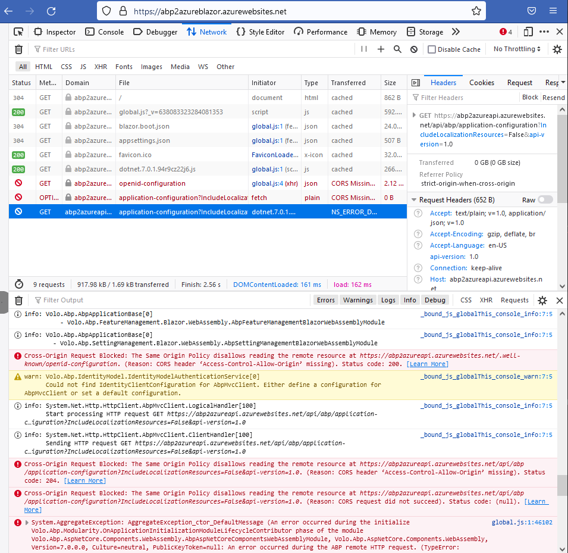

## Blazor Deployment succeeded. Web App still not working. Fix the issues

* When the Release pipeline has finished and the BlazorDeployment succeeded, open a browser window and navigate to the URL of your Blazor Web App

```html	
    https://[YourAppName]blazor.azurewebsites.net
```
* You will probably see the error below



* add the URL (https://[YourAppName]blazor.azurewebsites.net) to the CorsOrigins section i
* Open the **Releases** menu in **AzureDevOps**. 
* Click the **Edit** button. 
* Click on the **Variables** tab on the top of the page
* Click on the **+ Add link** to add a new entry

```bash
// Name
    App.CorsOrigins

// Value 
    https://*.Abp2Azure.com,https://localhost:44383,https://[YourAppName]blazor.azurewebsites.net
```

* Click on the **+ Add link** to add a new entry

```bash
    // Name
App.SelfUrl

// Value 
    https://abp2azureapi.azurewebsites.net/
```

* Click **Save**, **Ok**, and **Create release**

[[Home]](../README.md) - [[Previous]](tutorial/../9.add-an-extra-stage-in-the-release-pipeline-for-the-blazor-project.md)