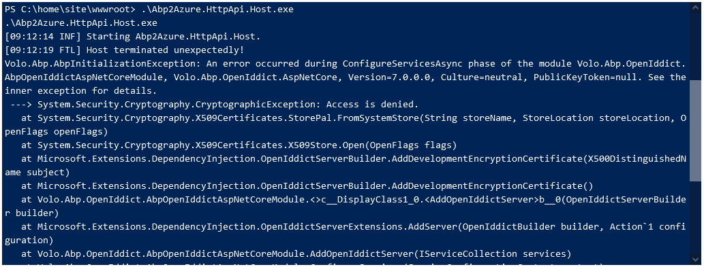
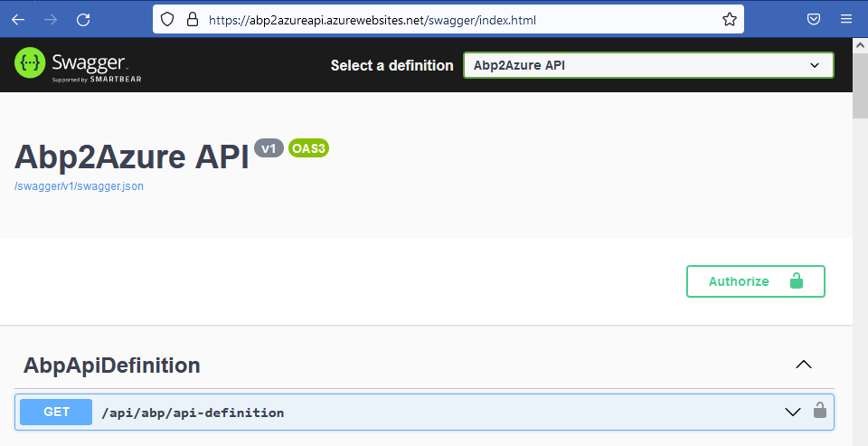

## API Deployment succeeded. Web App not working. Fix the issues

* Open the **CMD Debug Console** in the **Kudu** window by navigating to **[YourAppName]api.scm.azurewebsites.net**

* Run the **dir** command to check if [YourAppName].HttpApi.Host files have been deployed in the **home\site\wwwroot** folder

```bash
    dir
```

* Check the dotnet version of the Azure Web App. Should be 8.0.x

```bash
   dotnet --version
```


### HTTP Error 500.30 - - ASP.NET Core app failed to start

Run the command below in the **Kudu Console** to get the **error information** needed

```bash
   [YourAppName].HttpApi.Host.exe
```



### Solve CryptographicException

* In the **appsettings.json** file of the **[YourAppName].HttpApi.Host** project add section below

```bash
"MyAppCertificate": { 
      "X590": 
        { 
          "PassWord": "2efdddb2-41bc-4f3f-a1cf-825b1fca5b30" 
        }  
    }
```

* Copy/paste **appsettings.json** file and rename to **appsettings.Staging.json**
* Set SelfUrl and Authority to https://[YourAppName]api.azurewebsites.net

```bash
{
    "App": {
      "SelfUrl": "https://[YourAppName]api.azurewebsites.net",
      "CorsOrigins": "https://*.Abp2Azure.com,https://localhost:44326",
      "RedirectAllowedUrls": "https://localhost:44326"
    },
    "ConnectionStrings": {
      "Default": "Server=tcp:abp2azureserver.database.windows.net,1433;Initial Catalog=Abp2AzureDb;Persist Security Info=False;User ID=serveradmin;Password=Server2008!;MultipleActiveResultSets=False;Encrypt=True;TrustServerCertificate=False;Connection Timeout=30;"
    },
    "AuthServer": {
      "Authority": "https://[YourAppName]api.azurewebsites.net",
      "RequireHttpsMetadata": false,
      "SwaggerClientId": "Abp2Azure_Swagger"
    },
    "StringEncryption": {
      "DefaultPassPhrase": "rzFy34GkL3lA6vx0"
    },
    "MyAppCertificate": { 
        "X590": 
          { 
            "PassWord": "2efdddb2-41bc-4f3f-a1cf-825b1fca5b30" 
          }  
      }
  }

```

* In the **[YourAppName]HttpApiHostModule** of the **[YourAppName].HttpApi.Host** project add the code below

```csharp
// using System.Security.Cryptography.X509Certificates;
// using Volo.Abp.OpenIddict;
// using Microsoft.AspNetCore.Hosting;
// using System.Security.Cryptography;

        PreConfigure<OpenIddictBuilder>(builder =>
        {
            builder.AddValidation(options =>
            {
                options.AddAudiences("Abp2Azure");
                options.UseLocalServer();
                options.UseAspNetCore();
            });

            var hostingEnvironment = context.Services.GetHostingEnvironment();
            var configuration = context.Services.GetConfiguration();

            if (hostingEnvironment.IsDevelopment()) return;

            PreConfigure<AbpOpenIddictAspNetCoreOptions>(options =>
            {
                options.AddDevelopmentEncryptionAndSigningCertificate = false;
            });

            PreConfigure<OpenIddictServerBuilder>(builder =>
            {
                builder.AddEncryptionCertificate(GetEncryptionCertificate(hostingEnvironment, context.Services.GetConfiguration()));
                builder.AddSigningCertificate(GetSigningCertificate(hostingEnvironment, context.Services.GetConfiguration()));
                builder.SetIssuer(new Uri(configuration["AuthServer:Authority"]!));
            });
        });
    }

    private X509Certificate2 GetEncryptionCertificate(IWebHostEnvironment environment, IConfiguration config)
    {
        var fileName = "encryption-certificate.pfx";
        var password = config["MyAppCertificate:X590:Password"];

        var file = Path.Combine(environment.ContentRootPath, fileName);
        if (File.Exists(file))
        {
            var created = File.GetCreationTime(file);
            var days = (DateTime.Now - created).TotalDays;
            if (days > 180)
            {
                File.Delete(file);
            }
            else
            {
                return new X509Certificate2(file, password, X509KeyStorageFlags.MachineKeySet);
            }
        }


        using var algorithm = RSA.Create(keySizeInBits: 2048);
        var subject = new X500DistinguishedName("CN=Fabrikam Encryption Certificate");
        var request = new CertificateRequest(subject, algorithm,
            HashAlgorithmName.SHA256, RSASignaturePadding.Pkcs1);
        request.CertificateExtensions.Add(new X509KeyUsageExtension(
            X509KeyUsageFlags.KeyEncipherment, critical: true));
        var certificate = request.CreateSelfSigned(DateTimeOffset.UtcNow,
            DateTimeOffset.UtcNow.AddYears(2));
        File.WriteAllBytes(file, certificate.Export(X509ContentType.Pfx, password));
        return new X509Certificate2(file, password, X509KeyStorageFlags.MachineKeySet);
    }

    private X509Certificate2 GetSigningCertificate(IWebHostEnvironment environment, IConfiguration config)
    {
        var fileName = "signing-certificate.pfx";
        var password = config["MyAppCertificate:X590:Password"];
        var file = Path.Combine(environment.ContentRootPath, fileName);

        if (File.Exists(file))
        {
            var created = File.GetCreationTime(file);
            var days = (DateTime.Now - created).TotalDays;
            if (days > 180)
            {
                File.Delete(file);
            }
            else
            {
                return new X509Certificate2(file, password, X509KeyStorageFlags.MachineKeySet);
            }
        }

        using var algorithm = RSA.Create(keySizeInBits: 2048);
        var subject = new X500DistinguishedName("CN=Fabrikam Signing Certificate");
        var request = new CertificateRequest(subject, algorithm, HashAlgorithmName.SHA256, RSASignaturePadding.Pkcs1);
        request.CertificateExtensions.Add(new X509KeyUsageExtension(X509KeyUsageFlags.DigitalSignature,
            critical: true));

        var certificate = request.CreateSelfSigned(DateTimeOffset.UtcNow, DateTimeOffset.UtcNow.AddYears(2));

        File.WriteAllBytes(file, certificate.Export(X509ContentType.Pfx, password));
        return new X509Certificate2(file, password, X509KeyStorageFlags.PersistKeySet | X509KeyStorageFlags.MachineKeySet);
    }

```

### Let API generate the needed certificates

* Comment out the following statement

```csharp
  // if (hostingEnvironment.IsDevelopment()) return;
```

* Run [YourAppName].HttpApi.Host project to generate certificates

an encryption-certificate.pfx file to the root of the **[YourAppName].HttpApi.Host** project
a signing-certificate.pfx file to the root of the **[YourAppName].HttpApi.Host** project

* Update content of the **[YourAppName].HttpApi.csproj file

```bash
  <ItemGroup>
    <Compile Remove="Logs\**" />
    <Content Remove="Logs\**" />
    <EmbeddedResource Remove="Logs\**" />
    <None Remove="Logs\**" />

    <Content Include="encryption-certificate.pfx">
        <CopyToOutputDirectory>PreserveNewest</CopyToOutputDirectory>
    </Content>
    <Content Include="signing-certificate.pfx">
        <CopyToOutputDirectory>PreserveNewest</CopyToOutputDirectory>
    </Content>
  </ItemGroup>
```

* Make sure the **encryption-certificate.pfx** and **signing-certificate.pfx** certificates are added to git

* Uncomment the following statement

```csharp
  if (hostingEnvironment.IsDevelopment()) return;
```

* Open a command prompt in the root folder of your project. Add, Commit and Push all your changes to your GitHub repo

```bash
    git add .
    git commit -m Solve CryptographicExceptions
    git push
```

Pushing changes to your **GitHub** repository triggers a new **Build** as **Continuous Integration** is enabled.
When the **Build** has finished, a new **Release** will start. Wait until the Release has finished and the Deployment Succeeded

### API Up and Running



[[Previous]](tutorial/../6.create-a-release-pipeline-and-deploy-httpapi-host-project.md) - [[Next]](tutorial/../8.create-a-web-app-in-the-azure-portal-for-the-blazor-project.md)
