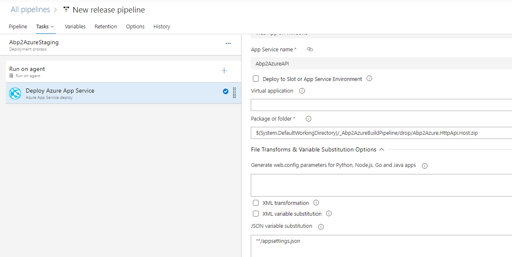

## API Deployment succeeded. Web App not working. Fix the issues

* Open the **Debug Console** in the **Kudu** window by navigating to **[YourAppName]api.scm.azurewebsites.net**

* Run the **dir** command to check if [YourAppName].HttpApi.Host files have been deployed in the **home\site\wwwroot** folder

```bash
    dir
```

* Check the dotnet version of the Azure Web App. Should be 6.0.x

```bash
   dotnet --version
```


### HTTP Error 500.30 - - ASP.NET Core app failed to start

* To solve error **HTTP Error 500.30** add **&lt;AspNetCoreHostingModel&gt;OutOfProcess&lt;/AspNetCoreHostingModel&gt;** to the **[YourAppName].HttpApi.Host.csproj** file right below the **TargetFramework** tag

* Open a command prompt in the root folder of your project. Add, Commit and Push all your changes to your GitHub repo

```bash
    git add .
    git commit -m OutOfProcess
    git push
```

* Pushing changes to your GitHub repo repository triggers a **new Build** as **Continuous Integration** is enabled in the Build pipeline.

### Http Error 502.5 - ANCM Out-Of-Process Startup Failure

* The release succeeded but I got **Http Error 502.5 - ANCM Out-Of-Process Startup Failure**


To fix **HTTP Error 502.5** continue with blog post [[How to fix HTTP Error 502.5- ANCM Out-Of-Process Startup Failure]](tutorial/../internal-cryptography-cryptothrowhelper-windowscryptographicexception-access-is-denied.md) and come back afterwards.

* After following the instructions from the blog post above, open the **Debug Console** in the **Kudu Engine** in **[YourAppName]api.scm.azurewebsites.net** again

* Run **[YourAppName].HttpApi.Host.exe** in the **Kudu Debug Console** to see if there are any errors.
  
```bash
    C:\home\site\wwwroot>[YourAppName].HttpApi.Host.exe
```

### An error occurred using the connection to database: Login failed for user 'serveradmin'

```bash
An error occurred using the connection to database '<YourAppName>Db' on server 'tcp:abp2azureserver.database.windows.net,1433'.

[23:49:46 ERR] An exception occurred while iterating over the results of a query for context type 'Volo.Abp.BackgroundJobs.EntityFrameworkCore.BackgroundJobsDbContext'.

Microsoft.Data.SqlClient.SqlException (0x80131904): Login failed for user 'serveradmin'.
   at Microsoft.Data.ProviderBase.DbConnectionPool.CheckPoolBlockingPeriod(Exception e)
   at Microsoft.Data.ProviderBase.DbConnectionPool.CreateObject(DbConnection owningObject, DbConnectionOptions userOptions, DbConnectionInternal oldConnection)
   at Microsoft.Data.ProviderBase.DbConnectionPool.UserCreateRequest(DbConnection owningObject, DbConnectionOptions userOptions, DbConnectionInternal oldConnection)
   at Microsoft.Data.ProviderBase.DbConnectionPool.TryGetConnection(DbConnection owningObject, UInt32 waitForMultipleObjectsTimeout, Boolean allowCreate, Boolean onlyOneCheckConnection, DbConnectionOptions userOptions, DbConnectionInternal& connection)
   at Microsoft.Data.ProviderBase.DbConnectionPool.WaitForPendingOpen()
```

This exception is completely normal behavior, because the password 'WrongPassword!' in the **connection string** of the **appsettings.json** file published to the **GitHub repository** is not the correct password.

* Open the **Releases** menu in **AzureDevOps**. Click on the **View stage tasks** link in the **[YourAppName]Staging Task** section.
* Click on the Deploy Azure App Service task.
* Open the File Transforms & Variable Substitution Options dropdown.
* Enter `**/appsettings.json` in the JSON variable substitution input.



* Click on the **Variables** tab on the top of the page
* Click on the + Add link to add a new entry

```bash
// Name
ConnectionStrings.Default    

//Value
Server=tcp:abp2azureserver.database.windows.net,1433;Initial Catalog=Abp2AzureDb;Persist Security Info=False;User ID=serveradmin;Password=CorrectPasswordHere;MultipleActiveResultSets=False;Encrypt=True;TrustServerCertificate=False;Connection Timeout=30;
```


* Open a command prompt in the root folder of your project and Add, Commit and Push all your changes to your GitHub repository

```bash
   git add .
   git commit -m OutOfProcess
   git push
```

Pushing changes to your **GitHub** repository triggers a new **Build** as **Continuous Integration** is enabled.
When the **Build** has finished, a new **Release** will start.

* Wait until the Release has finished and the Deployment Succeeded
* Navigate to the **[YourAppName]api.azurewebsites.net** of the Web App. You probably see the error **This page isn't working**.

### This page isn't working. [YourAppName]api.azurewebsites.net is currently unable to handle this request

* Open the **Debug Console** in the **Kudu Engine** in **[YourAppName]api.scm.azurewebsites.net** again

* Run **[YourAppName].HttpApi.Host.exe** in the **Kudu Debug Console** to see if there are any errors.
  
```bash
    C:\home\site\wwwroot>[YourAppName].HttpApi.Host.exe
```

* If you receive no Error description. Go to **Program.cs** in the [YourAppName].HttpApi.Host project and **comment out the if debug** statements</p>


[[Previous]](tutorial/../6.create-a-release-pipeline-and-deploy-httpapi-host-project.md) - [[Next]](tutorial/../8.create-a-web-app-in-the-azure-portal-for-the-blazor-project.md)
