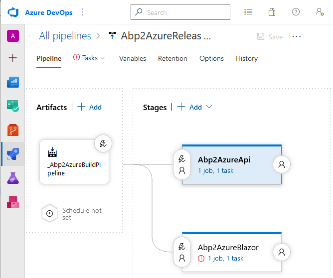
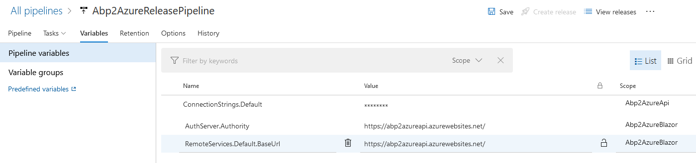

## Add a Stage in the Release pipeline for the Blazor project

* Go to the Release pipeline in Azure DevOps and click the **Edit** button

* Click the **+ Add link** and add a **+ New Stage**



* Select **Azure App Service deployment** and click the **Apply** button

* Enter [YourAppName]Blazor in the Stage name input field and close the Stage window

* Click on the **little red circle with the exclamation mark** in the [YourAppName]Blazor stage

* Select your subscription in the **Azure subscription** dropdown

* Select your [YourAppName]Blazor Web App in the **App service name** dropdown

* Click on the **Deploy Azure App Service** task

* Select **WebApp.zip** in the **Package or folder** input field


* Enter **/appsettings.json in the JSON variable substitution input field

* Click on the Variables tab and add the variables **AuthServer.Authority** and **RemoteServices.Default.BaseUrl** as in the image below



* Click Save in the top menu and click on the OK button after

* Click Create release in the top menu and click on the Create button

* Open a browser when the Release has finished and navigate to the URL of your Web App. Open the Developer Tools (F12) of your browser

```html
    https://[YourAppName]blazor.azurewebsites.net
```

* After the deployment you will probably see some errors in the **console window** (F12) of your browser. We will fix them in the next part


[[Previous]](tutorial/../8.create-a-web-app-in-the-azure-portal-for-the-blazor-project.md) - [[Next]](tutorial/../10.deployment-blazor-project-succeeded-web-app-still-not-working-fix-the-issues.md)